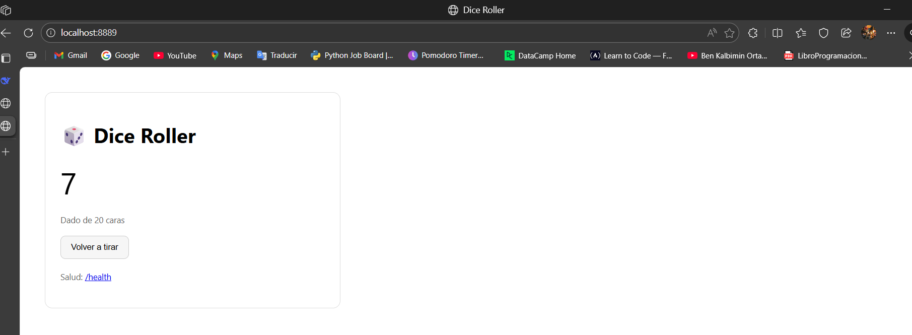
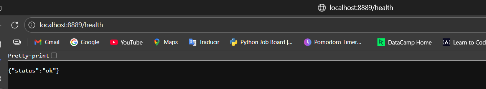
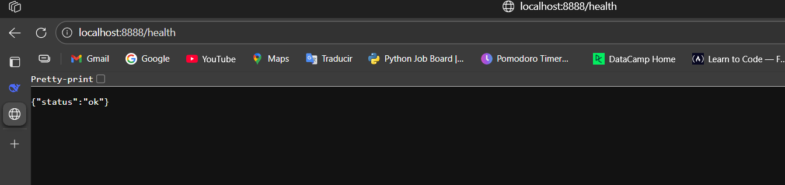

# 🎲 Flask Dice Roller

A Dockerized Flask application that simulates dice rolls with customizable number of sides.

## 🚀 Features

- Roll virtual dice with configurable number of sides
- Health check endpoint
- Docker containerization
- Environment variable configuration

## 📋 Prerequisites

- Docker installed on your system

## 🛠️ Installation & Usage

### Build the Docker Image
```bash
docker build -t dice_app .


## 📸 Screenshots

**Default 6-Sided Dice:**


**Custom 20-Sided Dice:**  


**Health Check Working:**

